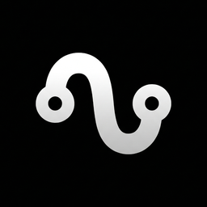

<p align="center">
  
</p>

<h1 align="center">Riva</h1>

<p align="center">
  <strong>Your Azure DevOps. Without the noise.</strong>
</p>

<p align="center">
  A fast, native desktop client for Azure DevOps — built for developers who want quick access to work items, pipelines, pull requests, and releases without the browser overhead.
</p>

<p align="center">
  
  
  
  
  
  
</p>

---

## Features

**Dashboard** — Sprint overview with stats (tasks, reviews, running pipelines), recent work items, and pipeline status at a glance.

**My Work** — All your assigned work items with status grouping, type filtering (Task, Bug, PBI, Feature, Epic), sorting, and full-text search.

**Work Item Details** — View and update status with validated state transitions, edit titles, copy git branch names, and browse related items.

**Pipelines** — Monitor build pipelines with live status indicators, progress bars for running builds, and definition-based filtering.

**Pull Requests** — Review PRs directly from the app — approve, reject, filter by status (Active, Draft), search by title or author, and filter by repository.

**Releases** — Track release pipelines with environment deployment status, and approve or reject deployments with comments.

**AI Standup Summary** — Generate a standup summary from your recent activity using OpenAI. Configurable lookback period, one-click copy to clipboard.

**Notifications** — Polls Azure DevOps for PR reviews, pipeline failures, and work item mentions. Native OS notifications with sound support.

**Themes** — 9 dark themes: Midnight, Phosphor, Dracula, Monochrome, Crimson, Catppuccin, Sunburn, Claude, and Red Dead.

---

## Tech Stack

| Layer | Technology |
|-------|-----------|
| Desktop framework | [Tauri 2.0](https://v2.tauri.app/) (Rust) |
| Frontend | React 19, TypeScript 5.8 |
| Styling | Tailwind CSS 4, Radix UI, custom design tokens |
| State | Zustand 5 (global), TanStack Query 5 (server) |
| Forms | React Hook Form + Zod |
| Animations | Motion |
| HTTP | reqwest (Rust — PAT never exposed to frontend) |
| AI | OpenAI API (via Rust backend) |
| Package manager | Bun |
| Build tool | Vite 7 |

---

## Getting Started

### Prerequisites

- [Bun](https://bun.sh/) (package manager)
- [Rust](https://rustup.rs/) (for native builds)
- An Azure DevOps organization with a [Personal Access Token (PAT)](https://learn.microsoft.com/en-us/azure/devops/organizations/accounts/use-personal-access-tokens-to-authenticate)

### Install

```bash
git clone https://github.com/YuriPerro/forge.git riva
cd riva
bun install
```

### Development

```bash
# Frontend only (no Rust required) — runs on port 1420
bun dev

# Full native app (requires Rust)
bun tauri dev
```

### Build

```bash
# Frontend bundle
bun run build

# Native app (.dmg / .exe / .AppImage)
bun tauri build
```

### Code Quality

```bash
bunx tsc --noEmit      # Type check
bun run lint           # ESLint
bun run lint:fix       # ESLint autofix
bun run format         # Prettier format
bun run format:check   # Prettier check
```

---

## Architecture

```
┌─────────────────────────────────────────┐
│            React 19 Frontend            │
│  (webview — no direct HTTP to Azure)    │
│                                         │
│   invoke('command', { args })           │
└──────────────────┬──────────────────────┘
                   │ IPC
┌──────────────────▼──────────────────────┐
│           Tauri 2.0 / Rust              │
│                                         │
│   #[tauri::command] handlers            │
│   Azure DevOps REST API (reqwest)       │
│   OpenAI API integration                │
│   Secure credential storage             │
└─────────────────────────────────────────┘
```

All Azure DevOps API calls go through Rust. The PAT token is stored securely and never exposed to the webview layer.

---

## Project Structure

```
src/
├── pages/           # Dashboard, Tasks, Pipelines, Pull Requests, Releases, Settings
├── components/      # Shared UI components (shadcn/ui based)
├── store/           # Zustand stores (auth, theme, notifications, openai)
├── hooks/           # Global custom hooks
├── lib/             # Core infra (Tauri invoke wrapper, theme manager)
├── types/           # Shared TypeScript types (azure, work-item, pipeline, release)
├── utils/           # Helpers (formatters, mappers, search)
├── styles/          # Global CSS with design tokens and themes
└── routes/          # Route configuration

src-tauri/src/
├── main.rs          # Entry point
├── lib.rs           # Tauri command registration (35+ commands)
├── azure.rs         # Azure DevOps API client
└── openai.rs        # OpenAI integration
```

---

## Security

- PAT tokens are stored in the Rust backend and never sent to the webview
- All Azure DevOps HTTP requests go through Rust (reqwest)
- No direct API calls from the frontend

---

## License

Private project. All rights reserved.
